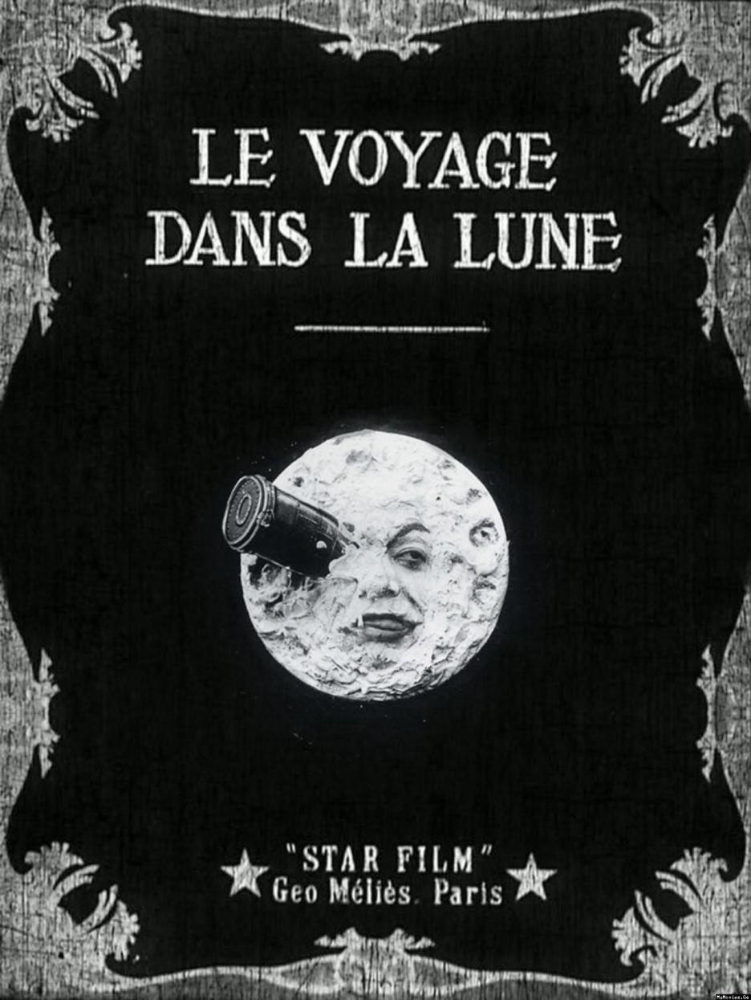
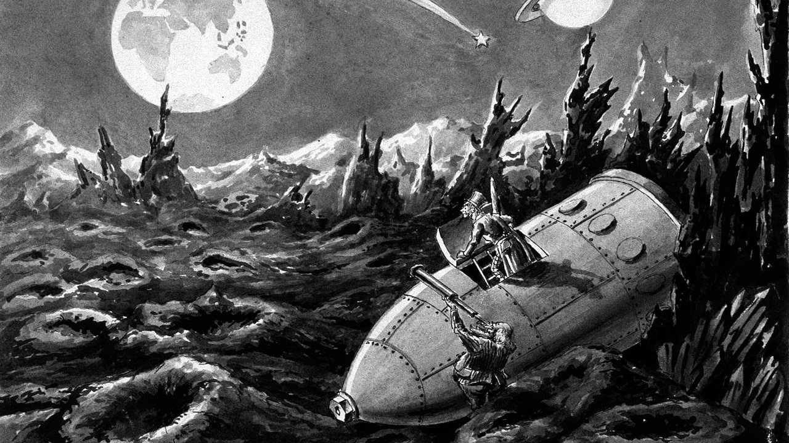
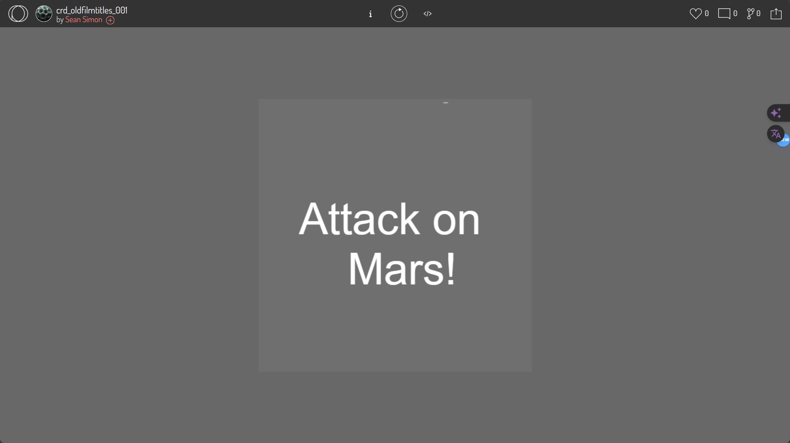

# QUIZ-8
zlai0110
# Peace Dove Animation Project

This project aims to create a peace dove animation styled like old silent films, emulating the visual effects of early film cinema. The following content includes the inspiration, technical implementation, and related code for the project.

## Inspiration

The visual inspiration for this project primarily comes from the following aspects:

### Artistic Style References

1. **Georges Méliès' "A Trip to the Moon"** - Famous for its stop-motion animation and multiple exposure techniques, this film provides the core visual inspiration for our project.
2. **Early 20th-century silent films** - The distinctive black and white tones, frame rates, and visual effects of this era significantly influence the animation style of the peace dove.
3. **Artwork References**:
    
This image showcases typical visual characteristics of early cinema.
  
  An image displaying the slient show

### Technical References

- **p5.js** - A JavaScript library well-suited for rapid development of visual art projects. [p5.js Official Website](https://p5js.org/)
- **Old animation techniques** - Such as stop-motion animation and multiple exposures, which will be simulated in our code implementation.
- **OpenProcessing Example** - Provides a technical example of animation implementation, reference link at [OpenProcessing Sketch](https://openprocessing.org/sketch/743533).

## Technical Implementation

This project is implemented using p5.js, simulating the visual effects of old film cinema through programming methods.

### Core Features

- **Stop-motion Animation**: Simulates the flying animation of the peace dove.
- **Multiple Exposure Effects**: Creates visual effects of ghosting or double exposures on the screen to enhance the retro feel.

